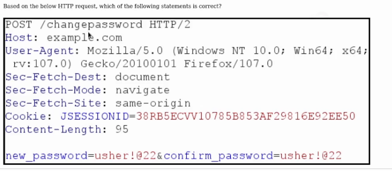
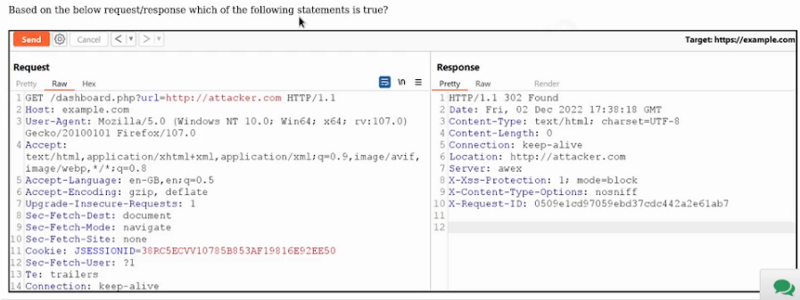
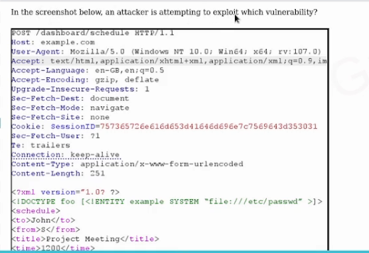
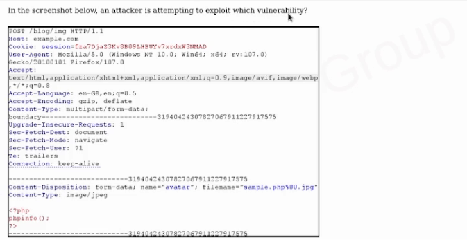
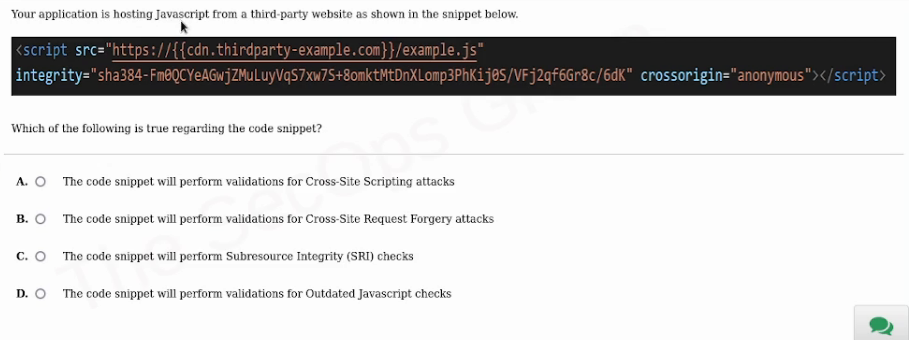
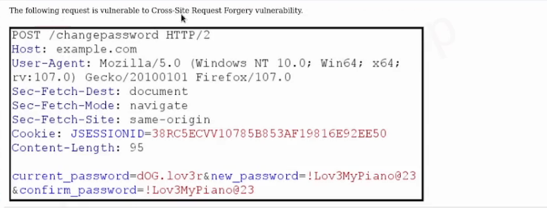

# CAPCertified AppSec Practitioner (CAP)

A website administrator forgot to renew the TLS certificate on time and as a result, the application is displaying a TLS error message. However, on closer inspection, it appears that the error is due to the TLS certificate expiry.  

 Which of the following is correct?
 --------------------------------------------

- [x] The communication between the browser and the server is now no longer over TLS
- [ ] The communication between the browser and the server is still over TLS

 

## Which of the following is NOT a symmetric key encryption algorithm?

- [ ] RC4
- [ ] AES
- [ ] DES
- [x] RSA

 

An application's forgot password functionality is described below:  
A user enters their email address and receives a message:  
"If the email exists, we will email you a link to reset the password"  
The user receives an email saying:  
Please use the link below to create a new password:  
http://example.com/reset_password?userid=5298  

Which of the following is true?
------------------------------------------

- [ ] The reset link uses an insecure channel
- [x] The application is vulnerable to username enumeration
- [ ] The application will allow the user to reset an arbitrary user's password
- [ ] Both A and C

 

## Which of the following SSL/TLS protocols are considered to be insecure?

- [ ] SSLv2 and SSLv3
- [ ] TLSv1.0 and TLSv1.1
- [x] Both A and B
- [ ] SSLv2, SSLv3, TLSv1.0, TLSv1.1, TLSv1.2 and TLSv1.3

 

## Based on the below HTTP request, which of the following statements is correct?

- [x] The change password feature does not validate the user
- [ ] The change password feature uses basic authorization
- [ ] The change password feature is vulnerable to Cross-Site Request Forgery attack
- [ ] All of the above

 

A website administrator forgot to renew the TLS certificate on time and as a result, the application is now displaying a TLS error message, as shown below. However, on closer inspection, it appears that the error is due to the TLS certificate expiry.
In the scenario described above,
  

which of the following is correct?
------------------------------------------

- [ ] There is no urgency to renew the certificate as the communication is still over TLS
- [x] There is an urgency to renew the certificate as the users of the website may get conditioned to ignore TLS warnings and therefore ignore a legitimate warning which could be a real Man-in-the-Middle attack
 

## Which is the most effective way of input validation to prevent Cross-Site Scripting attacks?

- [ ] Blacklisting HTML. and other harmful characters

- [x] Whitelisting and allowing only trusted input
- [ ] Using a Web Application Firewall (WAF)
- [ ] Marking Cookie as HttpOnly

 

## Based on the below request/response which of the following statements is true?

- [x] Application is likely to be vulnerable to Open Redirection vulnerability
- [ ] Application is vulnerable to Cross-Site Request Forgery vulnerability
- [ ] Application uses an insecure protocol
- [ ] All of the above

 

## Based on the screenshot above, which of the following is the most true?

- [x] The application is vulnerable to username enumeration
- [ ] The application is vulnerable to brute-force attacks
- [ ] The application does not enforce a strong password policy
- [ ] None of the above

 

## Which of the following headers helps in preventing the Clickjacking attack?

- [ ] Strict Transport-Security
- [ ] Access-Control-Allow-Origin
- [x] X-Frame-Options
- [ ] X-Content-Type-Options

 

## Which of the following is NOT an asymmetric key encrption algorithm?

- [x] AES
- [ ] RSA
- [ ] Diffie-Hellman
- [ ] DSA

 

## In the screenshot below, an attacker is attempting to exploit which Vulnerability?

- [ ] HTTP Desync Attack
- [ ] File path Traversal Attack
- [ ] Open URL Redirection
- [x] Server-Side Request Forgery

 

## Based on the screenshot below, which of the following statements is true?

- [ ] The application is using an outdated server technology
- [ ] The application is disclosing the server version
- [ ] The application is disclosing the version of the framework used
- [x] All of the above

 

## In the screenshot below, an attacker is attempting to exploit which vulnerability?

- [ ] Path Traversal Attack
- [ ] Server Side Template Injection
- [ ] XML Bomb Attack
- [x] XML External Entity Attack

 

## Which of the following directives in a Content-Security-Policy HTTP response header, can be used to prevent a Clickjacking attack?

- [ ] script-src
- [ ] object-src
- [x] frame-ancestors
- [ ] base-uri

 

## Which of the following security attributes ensures that the browser only sends the cookie over a TLS (encrypted) channel?

- [x] Secure
- [ ] HttpOnly
- [ ] No XSS
- [ ] None of the above

 

## Which of the following is true when the directive 'HttpOnly' is set on a cookie?

- [ ] It means that the application is no longer vulnerable to XSS vulnerability

- [x] JavaScript cannot access the cookie marked as HttpOnly
- [ ] Both A and B
- [ ] None of the above

 

## Which of the following is true when the directive 'HttpOnly' is set on a cookie?

- [ ] It means that the application is no longer vulnerable to XSS vulnerability
- [x] JavaScript cannot access the cookie marked as HttpOnly
- [ ] Both A and B

- [ ] None of the above

 

## A robots.txt file tells the search engine crawlers about the URLs which the crawler can access on your site. Which of the following is true about robots.txt?

- [x] Developers must not list any sensitive files and directories in this file
- [ ] Developers must list all sensitive files and directories in this file to secure them

 

After purchasing an item on an e-commerce website, a user can view their order details by visiting the URL:
https://example.com/?order_id=53870
A security researcher pointed out that by manipulating the order_id value in the URL, a user can view arbitrary orders and sensitive information associated with that order_id. There are two fixes:  
(Bob's Fix):  
In order to fix this vulnerability, a developer called Bob devised a fix so that the URL does not disclose the numeric value of the order id but uses a SHA1 hash of the order_id value in the URL, such as:  
https://example.com/?order_id=1ff0f7e61f599536d1326418124a261bc98b8ea1  
Note: that the SHA1 value of 53870 is 1ff0f7e61f599536d1326418124a261bc98b8ea1  
(John's Fix): 
Another developer called John devised a different fix so that the URL does not disclose the numeric value of the order_id and uses a Base64 encoded 
value of the order_id in the URL, such as:  
https://example.com/?order_id=NTM4NZAK  
Note: that the Base64 encoded value of 53870 is NTM4NZAK  

Which of the following is correct?
---------------------------------------------

- [x] Both solutions are adequate to fix the problem
- [ ] Both solutions are inadequate and the vulnerability is still not fixed
- [ ] Only John's solution fixes the problem
- [ ] Only Bob's solution fixes the problem

 

After purchasing an item on an e-commerce website, a user can view his order details by visiting the URL:  
https://example.com/?order_id=53870  
A security researcher pointed out that by manipulating the order_id value in the URL, a user can view arbitrary orders and sensitive information associated with that order_id.  

Which of the following is correct?
------------------------------------------

- [ ] The root cause of the problem is a lack of input validation and by implementing a strong whitelisting, the problem can be solved
- [x] The root cause of the problem is a weak authorization (Session Management) and by validating a user's privileges, the issue can be fixed
- [ ] The problem can be solved by implementing a Web Application Firewall (WAF)

- [ ] None of the above

 

## In the screenshot below, an attacker is attempting to exploit which vulnerability?

- [ ] HTTP Desync Attack
- [ ] File Path Traversal Attack
- [x] File Upload Vulnerability
- [ ] Server-Side Request Forgery

 

## The application is vulnerable to Cross-Site Scripting. Which of the following exploitation is NOT possible at all?

- [ ] Steal the user's session identifier stored on a non HttpOnly cookie
- [ ] Steal the contents from the web page
- [x] Steal the contents from the application's database
- [ ] Steal the contents from the user's keystrokes using keyloggers

 

## Which of the following hashing algorithms is considered to be the most secure amongst these?

- [ ] SHA-0
- [ ] MD5
- [ ] SHA-1
- [x] Bcrypt

 

## Multifactor authentication will not be able to prevent:

- [ ] Cross-Site Scripting Vulnerability
- [ ] Cross-Site Request Forgery Vulnerability
- [ ] Path Traversal Vulnerability
- [x] All of the above

 

## Which of the following attributes is NOT used to secure the cookie?

- [ ] HttpOnly
- [ ] Secure
- [x] Restrict
- [ ] Same-Site

 

## Determine the primary defenses against a SQL injection vulnerability

- [ ] Using a Web Application Firewall (WAF)
- [x] Prepared Statements with Parameterized Queries
- [ ] Use of NoSQL Database
- [ ] Blacklisting Single Quote Character (')

 

## Which of the following HTTP response header prevents the client from caching the HTTP response in the most secure manner?

- [x] Cache-Control: no-cache, no-store
- [ ] Secure-Cache: Enabled
- [ ] Cache-Control: Private
- [ ] Content-Security-Policy: no-cache, no-store

 

## Scan the code below and identify the vulnerability which is the most applicable for this scenario.

- [ ] The code snippet will perform validations for Cross-Site Scripting attacks
- [ ] The code snippet will perform validations for Cross-Site Request Forgery attacks
- [x] The code snippet will perform Subresource Integrity (SRI) checks
- [ ] The code snippet will perform validations for Outdated Javascript checks

 

## Your application is hosting Javascript from a third-party website as shown in the snippet below.

Which of the following is true regarding the code snippet?
------------------------------------

- [ ] The code snippet will perform validations for Cross-Site Scripting attacks
- [ ] The code snippet will perform validations for Cross-Site Request Forgery attacks
- [x] The code snippet will perform Subresource Integrity (SRI) checks
- [ ] The code snippet will perform validations for Outdated Javascript checks

 

## Observe the HTTP request below and identify the vulnerability attempted.

- [ ] Cross-Site Request Forgery Vulnerability
- [x] Path Traversal Vulnerability
- [ ]  Code Injection Vulnerability
- [ ] All of the above

 

## Which of the following is the best way to store passwords in a database?

- [ ] Encode in a Base64 format
- [ ] Use strong encryption such as 3DES with a strong key
- [ ] Hash with a one way hashing function such as SHA512
- [x] Hash with a unique salt for each user

<b>

After purchasing an item on an e-commerce website, a user can view their order details by visiting the URL:  
https://example.com/?order_id=53870  
A security researcher pointed out that by manipulating the order_id value in the URL, a user can view arbitrary orders and sensitive information associated with that order_id. This attack is known as:
------------------------------------------

- [x] Insecure Direct Object Reference
- [ ] Session Poisoning
- [ ] Session Riding OR Cross-Site Request Forgery
- [ ] Server-Side Request Forgery

 

## Which of the following is NOT a Server-Side attack?

- [ ] OS Code Injection
- [x] Cross-Site Request Forgery
- [ ] SQL Injection
- [ ] Directory Traversal Attack

 

An application's forgot password functionality is described below:  
The user enters their email address and receives a message on the web page:  
"If the email exists, we will email you a link to reset the password"
The user also receives an email saying:  
Please use the link below to create a new password:  
(Note that the developer has included a one-time random token with the 'userid' parameter in the link). So, the link seems like:   https://example.com/reset_password?userid=5298&token=70e7803e-bf53-45e1-8a3f-fb15da7de3a0  
Will this mechanism prevent an attacker from resetting arbitrary users' passwords?
------------------------------------------

- [ ] True
- [x] False

 

## The following request is vulnerable to Cross-Site Request Forgery vulnerability.

- [x] True
- [ ] False

 

## In the screenshot below, which of the following is incorrect:

- [x] The application discloses the framework name and version
- [ ] The application reveals user-agent details
- [ ] A cookie is set with HttpOnly and a Secure Flag
- [ ] The application accepts insecure protocol

 

## Which of the following is correct?

- [ ] The browser contains the private key of all known Certifying Authorities (CA) and based on that, it differentiates between a valid and an invalid TLS Certificate
- [x] The browser contains the public key of all known Certifying Authorities (CA) and based on that it is able to differentiate between a valid and an invalid TLS Certificate
- [ ] The browser contains both the public and private key of all known Certifying Authorities (CA) and based on that it is able to differentiate between a valid and an invalid TLS Certificate
- [ ] The browser does not have any mechanism to validate the TLS Certificate

 

Under the same-origin policy (also SOP), a web browser permits scripts contained in a web page to access data in another web page, but only if both web pages have the same origin.  
Which of the following pages are in the same origin as that of the below URL?  
http://www.example.com/dir/page2.html  

1. http://www.example.com/dir2/other.html
2. http://www.example.com:81/dir/other.html 
3. https://www.example.com/dir/other.html
4. http://en.example.com/dir/other.html
-----------------------------------------------------------------
- [ ] 1 Only
- [ ] 1 and 2
- [ ] 1,3 and 4
- [x] None of the above

 

## Which of the following is considered as a safe password?

- [ ] Monday@123
- [ ] abcdef
- [x] SolQh$182%&ak
- [ ] 1234567890
